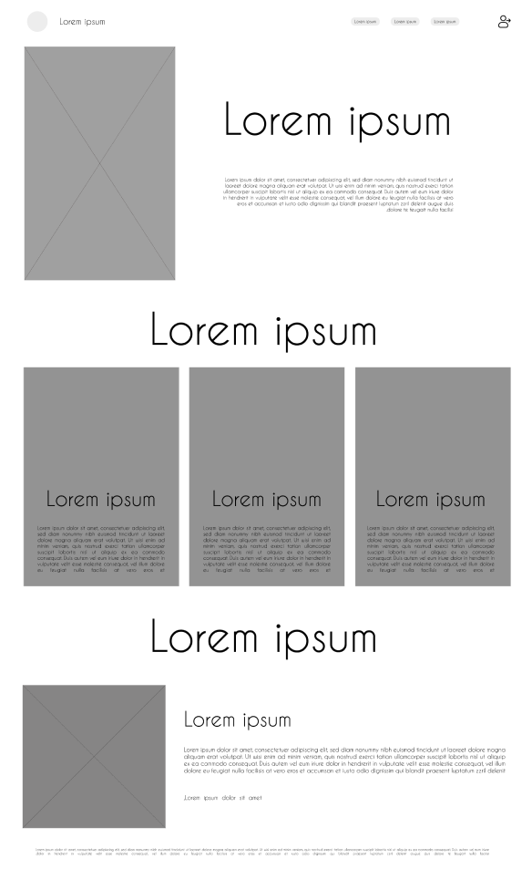
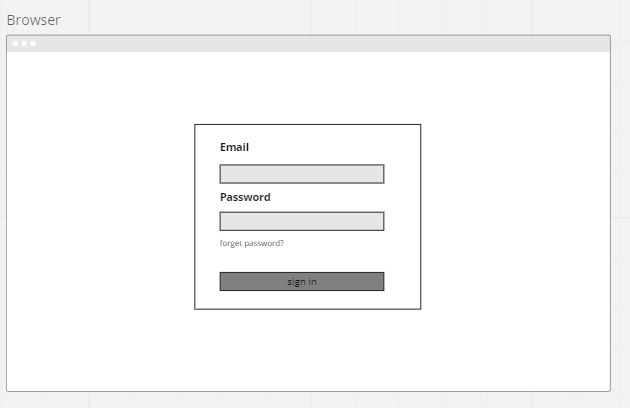
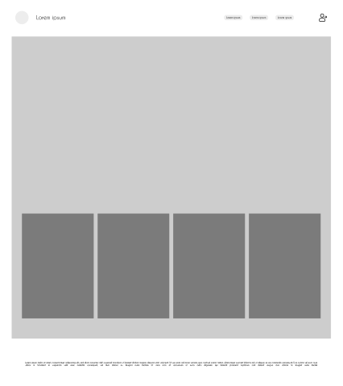
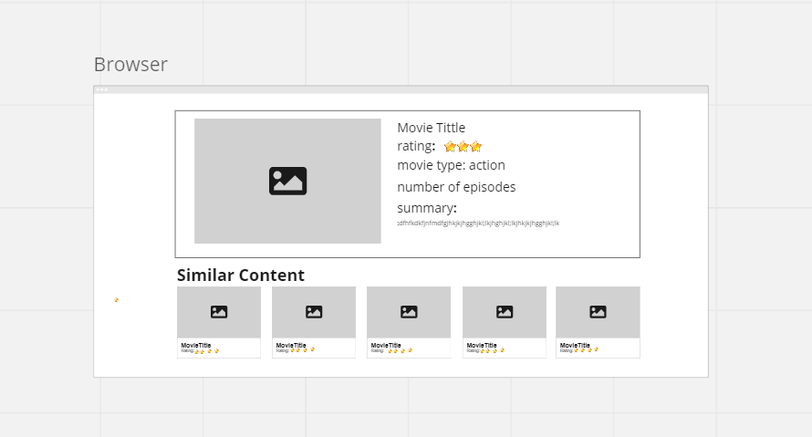

# AnimeTopia: Anime Platform

## Our Team Members

* Dua'a Hammo
* Rula Alqudah
* Hamza Almuhisen
* Khadijah Saleh
* Ziad Abazeed
* Dania Alreqb
* Luma Hatamleh

## Project Overview

AnimeTopia is a platform designed specifically for anime lovers. Our goal is to provide a comprehensive and convenient way for fans to access a wide range of anime content in one place. Gone are the days of searching for individual shows or relying on fragmented sources. With AnimeTopia, users can rely on a dedicated platform that offers a vast library of anime titles. Additionally, we aim to enhance user engagement by incorporating interactive characters and captivating designs.

## Summary of Idea

Creating a platform for anime lovers to watch anime, interact with characters, and get the latest news. The platform will also include ratings for anime and showcase the top watched ones.

## The problem it solves

 Anime fans often struggle to find a centralized platform for accessing a wide range of anime content. Instead of searching for individual shows or relying on fragmented sources, AnimeTopia provides a dedicated platform with a vast library of anime titles. Furthermore, AnimeTopia aims to enhance user engagement through interactive characters and captivating designs.

## Wireframe

To get a visual representation of our platform, you can refer to our  [Wireframe](https://www.figma.com/file/wGdL1J6dsbJCFBndGSmNyu/Untitled?type=design&node-id=0%3A1&t=dSOUdVBFEti2BxbW-1) designs . The wireframes provide an overview of the different pages and their layout.

## Designs

To experience the aesthetics and user interface of AnimeTopia, check out our live [Designs](https://www.figma.com/file/2HEL715qPdNmWbvvK6Z3jT/animetopia?type=design&node-id=1%3A166&t=mgTCMymk1kuwBQ2l-1). The live design showcases the visual elements, color schemes, and interactions that make up the AnimeTopia platform.

## Deployed

Feel free to explore AnimeTopia on our live page [Deployed](https://tripleone101.github.io/AnimePlatform/). The live page allows you to navigate through the different sections and experience the functionality of AnimeTopia firsthand.
___

## Wireframe Details

### Home Page

The home page is the entry point of AnimeTopia. It provides an overview of featured anime shows, recommendations, and quick access to different sections of the platform.

### Sign In Page

### All Anime PAge

### Anime Details Page

### Movies Page

